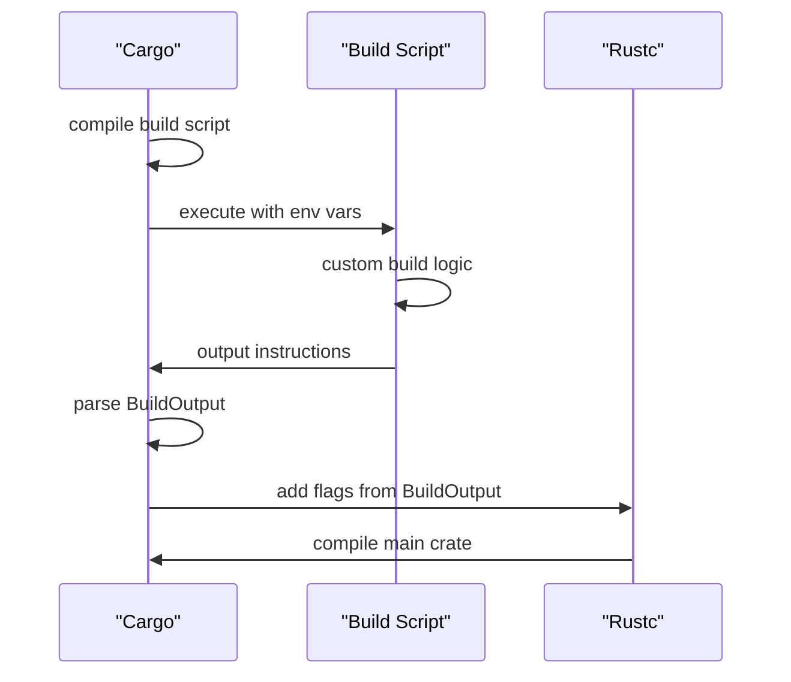
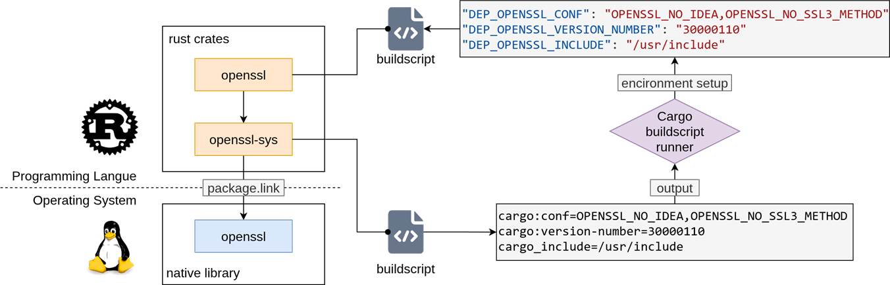

## Introduction

Cargo is the standard build tool for Rust, offering simplicity and ease of use for small to medium-sized projects. However, its monolithic build model struggles at scale—particularly in large monorepos where distributed caching, fine-grained parallelism, and cross-language integration are critical.

To address Cargo's limitations in building complex projects, we conducted a comprehensive survey of mainstream large-scale build systems, including Bazel, GN, and Buck2. We evaluated each solution based on criteria such as performance, scalability, and specifically the depth of support for the Rust language. After careful comparison, Buck2 emerged as the optimal choice due to its robust architecture and growing ecosystem compatibility.

[Buck2](https://buck2.build), a next-generation build system developed in Rust and open-sourced by Meta, addresses these limitations with a globally optimized action graph, native support for remote execution, and unified multi-language builds. Yet adopting Buck2 traditionally requires significant overhead: writing Starlark rules, managing BUCK files, and understanding Buck2’s configuration model—barriers that deter many Rust teams.

To bridge this gap, we developed **Buckal** (also known as [cargo-buckal](https://github.com/buck2hub/cargo-buckal)), a Cargo external subcommand that brings seamless Buck2 integration to Rust projects. It automatically generates Buck2 build rules from `Cargo.toml`, manages project setup, and provides a familiar cargo-like CLI experience—all without requiring developers to write or maintain `BUCK` files.

In this article, we discuss the design and implementation of Buckal, its real-world impact in the [rk8s](https://github.com/rk8s-dev/rk8s) project, and our vision for making high-performance, scalable builds accessible to the broader Rust ecosystem.

## Limitations of Cargo in Large-Scale Projects

While Cargo works well for standalone crates and small workspaces, it faces fundamental scalability challenges in large-scale development environments. Three key limitations stand out:

First, **Cargo lacks support for distributed builds**. Its local-only execution model prevents effective use of remote caching and remote execution, leading to redundant compilation across developers and CI pipelines. This results in longer wait times and higher resource costs.

Second, **build parallelization is coarse-grained and often inefficient**. Although Cargo can compile multiple crates in parallel, its dependency model does not enable fine-grained task scheduling. As crate graphs grow more complex, CPU utilization drops and end-to-end build times increase disproportionately.

Third, **Cargo offers no native support for cross-language builds**. Teams combining Rust with C/C++, Python, or other languages must rely on external tools like Make or CMake, breaking toolchain consistency and increasing maintenance burden.

These constraints make Cargo a bottleneck for teams building large, polyglot systems—where fast, reproducible, and composable builds are essential.

## How Buck2 Solves These Problems

Buck2 addresses the scalability limitations of Cargo through three key architectural advantages.

First, **Buck2 natively supports distributed caching and remote execution** via the Bazel spec of [Remote Build Execution](https://bazel.build/remote/rbe). This enables build actions to be executed remotely on shared worker clusters, with results cached and reused across developers and CI systems. A key enabler of this capability is hermeticity—the principle that builds are isolated from ambient environment state. Buck2 achieves this by declaratively managing toolchains (e.g., rustc, linker) as first-class dependencies, rather than relying on globally installed tools. This ensures that the same input produces bit-for-bit identical outputs across different machines, making builds reproducible and cacheable by default.

Second, **fine-grained parallelism is achieved through a global action graph powered by DICE** (Dynamic Incremental Computation Engine). Unlike Cargo’s crate-level scheduling, Buck2 breaks builds into individual compilation units, enabling optimal task distribution and incremental rebuilds with minimal rework.

Third, **Buck2 is inherently multi-language**. Built in Rust and extended via Starlark—a deterministic, immutable dialect of Python—it allows users to define custom rules for any language. It currently supports C++, Python, Java, Go, Rust, and more, enabling unified builds across polyglot codebases.

## The Adoption Challenges of Buck2

Despite its technical advantages, adopting Buck2 in Rust projects introduces significant practical barriers.

First, **Buck2’s documentation and Cargo compatibility are incomplete**. The built-in prelude provides essential rules like `rust_library` and `rust_binary`, but their parameters are poorly documented and often lack full compatibility with Cargo features (e.g., embedded environment variables, `cargo::` instructions, or custom profiles). As a result, writing correct `BUCK` files requires trial and error, deep Buck2 knowledge, and manual workarounds—making onboarding slow and error-prone.

Second, **Buck2 does not replace Cargo’s package and dependency management**. While it can build Rust code, it cannot automatically resolve or fetch crates from crates.io. Teams must manually write BUCK files for every third-party dependency—a task that is neither scalable nor maintainable. Unlike Cargo’s declarative `Cargo.toml`, this shifts the burden onto developers to replicate dependency metadata in build logic.

Third, while Meta’s `reindeer` tool aims to automate `BUCK` file generation from `Cargo.toml`, it falls short in practice:

* Its zero-configuration mode produces minimal, often incorrect outputs, requiring extensive custom rules.
* It relies on `fixup.toml` to patch generated files, effectively replacing `BUCK` authoring with `fixup.toml` scripting—an unstable format with limited syntax guarantees and few official documentation.
* It introduces auxiliary `Cargo.toml` files into the repository, which can interfere with Cargo-based workflows and CI pipelines, while adding new commands (`reindeer buckify`) increases operational complexity.

## Buckal – Seamless Buck2 Integration for Rust

Buckal is built on a simple idea: **use Buck2 the way you use Cargo** — without changing your workflow, project layout, or mental model. Instead of forcing developers to learn Buck2 internals or maintain BUCK files, it leverages existing Cargo metadata and conventions to automatically generate and manage Buck2 configurations. The result is **a zero-config, drop-in experience that unlocks Buck2’s performance while preserving Cargo’s ergonomics**.

### Design Principles

#### Seamless integration with Cargo

Buckal treats `Cargo.toml` as the single source of truth. It uses `cargo metadata` to extract the full crate graph, including dependencies, features, target configurations, and source paths. Based on this information, it generates precise Buck2 build rules (`rust_library`, `rust_binary`, etc.) with correct visibility, deps, and attributes. Generated `BUCK` files also include standard Cargo environment variables (e.g., `CARGO_PKG_NAME`, `CARGO_PKG_VERSION`) by default, reducing the need for manual adjustments.

#### Non-intrusive by design

The plugin does not modify project structure or introduce auxiliary configuration files (e.g., no extra `Cargo.toml`). Aside from local cache directories, it leaves the repository unchanged. When regenerating `BUCK` files, it parses existing ones and preserves user-defined modifications (e.g., custom flags or environment variables), ensuring compatibility with manual overrides.

#### Consistent CLI experience

Commands like `cargo buckal build`, `add`, and `update` mirror their Cargo equivalents in both syntax and semantics. Under the hood, Buckal uses snapshotting and caching strategies to align Buck2’s execution model with Cargo’s expectations, so users get predictable outcomes without learning new patterns.

### Implementation Details

#### Dependency Resolution and BUCK File Generation

At the core of Buckal's automation is a comprehensive dependency analysis phase that leverages Cargo's own metadata to model the entire build graph. On invocation, Buckal runs `cargo metadata` to obtain a structured representation of the workspace, including the full set of packages, their dependencies, target configurations, and the workspace root. It also parses `Cargo.lock` to extract version pins and checksums for all dependencies, ensuring deterministic resolution.

This information is aggregated into an internal context structure that serves as the foundation for generating accurate Buck2 rules. For third-party crates, Buckal adopts a **remote-first strategy**: instead of vendoring dependencies into the repository (which bloats history and complicates updates), it configures Buck2 to fetch `.crate` archives directly from crates.io at build time. For each dependency, it generates a `BUCK` file defining an `http_archive` rule with verified integrity, followed by a corresponding `rust_library` rule that respects the crate's features, dependencies, and cfg settings. If the crate includes a `build.rs` script, Buckal further generates a `rust_binary` target to compile the script and a `buildscript_run` rule to execute it in a hermetic environment, mimicking Cargo's build-time behavior.

Following this, a corresponding `rust_library` rule is generated, respecting the crate’s features, dependencies, and cfg settings. If the crate includes a `build.rs` script, Buckal further generates a `rust_binary` target to compile the script and a `buildscript_run` rule to execute it in a hermetic environment, mimicking Cargo’s build-time behavior.

For first-party crates (workspace members), Buckal inspects each package's targets and generates native Buck2 rules under their respective directories. Currently, it supports `lib`, `bin` and `test` targets, producing `rust_library`, `rust_binary` and `rust_test` rules with appropriate visibility, sources, and integration with the broader action graph. This dual-path generation strategy ensures that both local development and distributed builds remain fast, correct, and consistent — with only minimal manual `BUCK` file maintenance required.

#### BUCK Parse & Patch

One of the key challenges in maintaining generated BUCK files is preserving manual modifications without requiring users to annotate or isolate their changes. To achieve this, Buckal implements a **runtime-based rule extraction and patch preservation mechanism** that avoids the complexity of full Starlark parsing.

Starlark — being a dialect of Python — allows function calls with rich syntax and arbitrary nesting, making AST-level analysis complex and regex-based approaches fragile. Instead of parsing the code directly, Buckal leverages the Python interpreter itself to extract rule parameters during execution. Using [PyO3](https://github.com/PyO3/pyo3), Buckal interacts with the Python runtime installed on the local machine and dynamically loads each `BUCK` file in a sandboxed environment where all Buck2 prelude functions (e.g., `http_archive`, `rust_library`) are replaced with instrumented versions. When the file executes, every rule invocation is captured, recording both the rule type and its keyword arguments. This approach enables precise, semantics-aware extraction of build rules with minimal overhead.

After parsing, Buckal performs **patch-aware regeneration**: when rewriting the BUCK file, it compares newly inferred values against previously captured user-defined fields. Mutable fields such as `env`, `rust_flags`, `features`, and `visibility` are stored internally as ordered maps or sets, enabling efficient diffing. Any entry not derived from `Cargo.toml` metadata is treated as a user patch and preserved in the next generation cycle. This ensures that developers can customize build behavior (e.g., adding sanitizer flags or test-specific environment variables) while still benefiting from automated synchronization of dependency graphs and target configurations — achieving true non-intrusive automation.

#### Cache and Snapshot Mechanism

To ensure both efficiency and behavioral consistency with Cargo, Buckal implements a lightweight **fingerprint-based cache system** that serves two critical purposes: enabling incremental updates by detecting changes in the dependency graph, and acting as a versioned snapshot to preserve command-line semantics across invocations.

Each fingerprint is a cryptographic hash (computed using [BLAKE3](https://github.com/BLAKE3-team/BLAKE3)) over a serialized representation of a package's relevant metadata — including the `PackageId`, resolved dependencies, enabled features, and target configurations. This data is serialized via [Bincode](https://crates.io/crates/bincode) before hashing, ensuring deterministic output. Because the fingerprint captures only semantically meaningful inputs, any change in the build graph — such as adding a dependency or toggling a feature — results in a detectable hash difference. The design is intentionally minimal: instead of storing full dependency graphs or rule ASTs, it retains only compact hashes. This reduces disk footprint, speeds up diff computation, and avoids redundancy with Buck2's own action graph caching.

On each invocation, Buckal loads the previous cache from disk, computes the current fingerprints for all packages, and compares them to identify modified nodes. For commands that mutate the dependency graph — such as `add`, `update`, or `remove` — Buckal delegates execution to the native `cargo` binary. However, before running the command, it takes a pre-execution cache snapshot. After the command completes, it re-computes the cache and performs a diff to determine exactly which crates were added, removed, or updated. This delta informs targeted regeneration of corresponding `BUCK` files, ensuring that BUILD file updates are precise, timely, and aligned with actual user actions. For non-mutating commands like `build`, `test`, or `run`, Buckal focuses on CLI compatibility, using the cache to validate the current build state and route targets correctly to Buck2 without altering the snapshot.

By combining incremental change detection with semantic snapshots, Buckal achieves a key goal: Buck2's performance with Cargo's predictable, reproducible UX.

### Cargo Compatibility

A critical barrier to adopting Buck2 for Rust projects is the deep reliance many crates have on Cargo’s specific build environment. As illustrated in our technical analysis, a significant portion of the Rust ecosystem depends on intricate mechanisms that go beyond simple compilation: **standard environment variables**, **`build.rs` script interactions**, and **the propagation of metadata through the dependency graph**. Unfortunately, Buck2’s built-in Rust rules provide insufficient support for these features out of the box. To address this, we developed a [compatibility layer](https://github.com/buck2hub/buckal-bundles) that extends Buck2’s native capabilities, **achieving near 100% parity with Cargo’s build environment**.



#### Comprehensive Environment Variable Injection

Cargo automatically injects a rich set of environment variables into every build process, which crates often rely on for versioning, feature detection, and path resolution. Our analysis revealed that Buck2’s default rules omit many of these standard variables. Buckal bridges this gap by automatically generating and injecting the full suite of `CARGO_PKG_*` (e.g., `CARGO_PKG_VERSION`, `CARGO_PKG_NAME`) and `CARGO_MANIFEST_*` variables into every target. Furthermore, for `build.rs` scripts, Buckal ensures the execution environment is fully populated with critical context variables that Buck2 lacks, such as `OPT_LEVEL`, `CARGO_MANIFEST_PATH`, and `CARGO_MANIFEST_LINKS`. This ensures that build scripts behave identically whether run under Cargo or Buck2.

#### Build Script Output and Metadata Propagation

Perhaps the most complex challenge lies in handling the output of `build.rs` scripts. Cargo allows scripts to emit instructions (e.g., `cargo::rustc-link-lib`, `cargo::rustc-cfg`) and custom metadata (`cargo::metadata`). While Buck2 supports basic compiler flags, it historically lacked support for the `links` manifest key and the associated metadata propagation mechanism. This mechanism is vital for crates like `openssl-sys`, which use `build.rs` to detect system libraries and pass that information (via `DEP_<NAME>_<KEY>` environment variables) to dependent crates.



Buckal implements a robust solution for this:

1. **Instruction Parsing:** It parses `cargo::` instructions from build script outputs and maps them to corresponding Buck2 rule attributes (e.g., linking flags, cfg settings). For features like `rustc-link-lib`, we not only implemented local support but also contributed fixes upstream to the Buck2 repository to improve native handling.
2. **Metadata Propagation:** We implemented the logic to capture `cargo::metadata` outputs and automatically propagate them as `DEP_` environment variables to downstream dependencies. This ensures that the complex dependency chains found in native-binding crates function correctly without manual intervention.

By meticulously reconstructing these environmental nuances, Buckal allows developers to migrate complex, dependency-heavy Rust projects to Buck2 without modifying a single line of source code or build script.

## Practical Experience in rk8s

[Rk8s](https://github.com/rk8s-dev/rk8s) is a lightweight, Kubernetes-compatible container orchestration system built on [Youki](https://github.com/containers/youki), implementing the Container Runtime Interface (CRI). It supports three primary workload types: standalone containers, Kubernetes-style pods, and Docker Compose-style multi-container applications. The codebase **spans over 240,000 lines of Rust across 20 subprojects**, organized as a Cargo workspace — making it a representative large-scale Rust monorepo.

Integrating Buck2 into rk8s was previously attempted using `reindeer`, but the workflow proved cumbersome:

```shell
reindeer --third-party-dir third-party vendor
reindeer --third-party-dir third-party buckify
buck2 build //project/...
```

This multi-step process required `reindeer` to be installed and configured in both developer and CI environments. Moreover, due to incomplete rule generation, **95 out of 683 crates** required manual fixes via `fixup.toml` — a significant maintenance burden.

With Buckal, migration became drastically simpler. Developers only need to run:

```shell
cargo buckal migrate
```

in the project root. Thanks to runtime build-script introspection and comprehensive rule generation, Buckal achieves fully automated BUCK file management: **no manual patching is required**, even for crates using native libraries or complex FFI setups.

More importantly, the build workflow is unified:

```shell
cargo buckal build  # replaces the entire reindeer + buck2 pipeline
```

**No auxiliary commands or pre-processing steps are needed.** The generated `BUCK` files are immediately consumable by Buck2, enabling direct integration with remote execution and caching backends.

As a result:

* CI pipelines no longer depend on `reindeer`, reducing setup complexity.
* Build configuration is consistent and automatically synchronized with `Cargo.toml`.
* Developer experience closely mirrors standard Cargo usage, lowering cognitive load.

Most notably, **end-to-end build time dropped from 8m30s to 5m40s — a 33% reduction** — even before enabling remote execution. This gain comes from better parallelization, more accurate dependency tracking, and reduced overhead in rule evaluation.

Buckal has thus enabled rk8s to fully leverage Buck2’s performance while maintaining a simple, maintainable, and Cargo-native development experience.

## Future Directions

While Buckal already enables seamless Buck2 integration for most Rust projects, our roadmap focuses on three key areas to further improve dependency intelligence, structural flexibility, and ecosystem hermeticity.

#### Enhanced Dependency Intelligence & Security

Buckal inherently constructs a complete dependency graph of the workspace during rule generation. We plan to leverage this rich data structure to provide advanced analysis tools that go beyond simple build automation:

* **Supply Chain Security:** By integrating vulnerability databases, Buckal will offer built-in CVE scanning directly within the build workflow. Developers can identify security risks in transitive dependencies without needing external tools.
* **Dependency Patching & Management:** We aim to implement fine-grained control over dependency versions. This includes the ability to upgrade or downgrade specific transitive nodes globally, resolving conflicts that are traditionally difficult to manage in Cargo alone.
* **Semver Resolution Hints:** When workspace members depend on different versions of the same crate, Cargo automatically unifies them by selecting a single version that satisfies all Semver constraints. However, this implicit selection may differ from developer expectations or cause compatibility issues. Buckal will detect such cases and prompt developers to verify the resolved version, preventing potential inconsistencies.

#### Support for Complex Workspace Hierarchies

Real-world monorepos often exhibit complex structures that exceed the standard single-level Cargo workspace model. Currently, Buckal supports flat workspace layouts, but future versions will introduce robust support for **nested Cargo Workspaces**.

This enhancement will allow teams to organize large codebases into hierarchical domains while maintaining a unified Buck2 build graph. Buckal will correctly resolve cross-workspace dependencies and generate appropriate `BUCK` files across directory boundaries, ensuring that organizational structure does not compromise build performance or correctness.

#### Deep Ecosystem Integration via Buck2Hub

To reduce per-project setup costs and maximize build hermeticity, we are evolving the concept of **Buck2Hub**—a public registry of pre-generated, verified build configurations. However, our vision extends beyond simply sharing BUCK files.

Many popular Rust crates rely on FFI or native links (e.g., `openssl-sys`, `ring`), traditionally requiring system-level dependencies that break reproducibility. Leveraging Buck2’s native multi-language capabilities, Buck2Hub will provide rules to **build these C/C++ dependencies from source** within the Buck2 action graph.

Instead of relying on `apt-get` or pre-built binaries, Buckal will fetch canonical rules from Buck2Hub to compile native libraries hermetically alongside Rust code. This approach ensures **true reproducibility**, **reduced external dependencies** and **unified toolchain**.

## Conclusion

The Rust ecosystem offers several build solutions, each with distinct trade-offs. To help teams choose the right tool for their needs, we summarize the characteristics of mainstream approaches below:

| **Criteria**                   | **Cargo**                                        | **GN**                                | **Buck2 (reindeer)**                                                | **Buck2 (buckal)**                                                  |
| ------------------------------ | ------------------------------------------------ | ------------------------------------- | ------------------------------------------------------------------- | ------------------------------------------------------------------- |
| **Design Philosophy**          | Rust-native tooling & Deep ecosystem integration | Meta-build system & Language-agnostic | Language-agnostic &  Parallelism, high scalability, reproducibility | Language-agnostic &  Parallelism, high scalability, reproducibility |
| **Dependency Management**      | Declarative & Automatic                          | Manual & Explicit                     | Semi-automatic & Manual patches                                     | **Automatic & No manual maintenance**                               |
| **Cross-Language Integration** | Relies on external toolchains                    | Designed for polyglot projects        | Native multi-language support                                       | Native multi-language support                                       |
| **Version Control & Release**  | Semver & Workspace                               | Highly customizable                   | Flexible customization and pipeline integration                     | Flexible customization and pipeline integration                     |
| **Learning Curve**             | **Low**                                          | **Moderate**                          | **High**                                                            | **Consistent with Cargo**                                           |
| **Ideal Use Cases**            | Pure Rust projects                               | Ultra-large polyglot projects         | Ultra-large polyglot projects & Enterprise-grade Monorepo           | Ultra-large polyglot projects & Enterprise-grade Monorepo           |

Buckal addresses a critical gap in the Rust tooling landscape by making enterprise-grade build infrastructure accessible without sacrificing developer experience. Its core value lies in three pillars: **zero-friction adoption** by treating `Cargo.toml` as the single source of truth and eliminating the need to maintain BUCK files; **near-perfect compatibility** through comprehensive environment variable injection and build script parsing that ensures existing crates compile without modification; and **scalable performance** that unlocks Buck2's distributed caching and fine-grained parallelism.

Looking ahead, **Buckal aims to become the definitive bridge between the Rust ecosystem and enterprise-grade build infrastructure**. We envision a future where Rust teams can seamlessly scale from single-developer crates to thousand-contributor monorepos without changing their mental model or workflow. By combining Cargo's ergonomics with Buck2's power—and fostering community collaboration through initiatives like Buck2Hub—we are committed to making high-performance, reproducible, and scalable builds the default, not the exception. Whether you are building a pure Rust application or a polyglot system spanning multiple languages, Buckal invites you to experience the best of both worlds: the simplicity of Cargo and the scalability of Buck2.
